# Capstone 1

[Data Analyst Jobs](https://www.kaggle.com/andrewmvd/data-analyst-jobs)

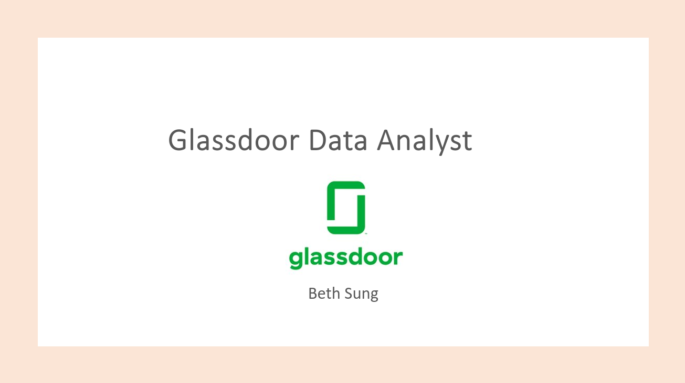

### information of the dataset:
  - 2253 job listings scraped from glassdoor
  - Job title :  1272
  - Salary Range :  90 
  - Job Description :  many
  - Rating : 37
  - Comapny Name : 2253
  - Location : 
  - Headquarter : 
  - Size
  - Founded
  - Type of ownership
  - Industry
  - Sector
  - Revenue
  - Competitors 
  - Easy To Apply

---------------------------- 

### States looking for data analysts are CA, TX, NY, and IL 

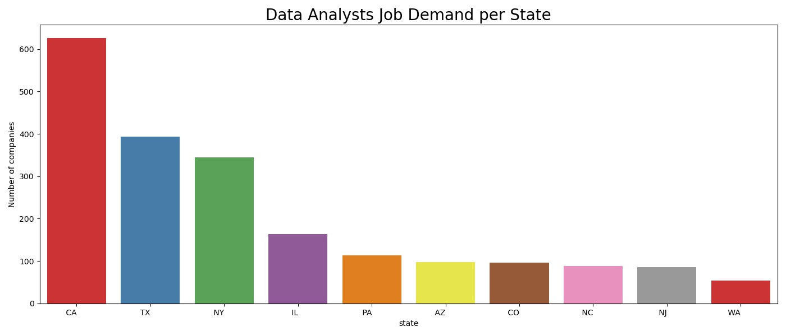

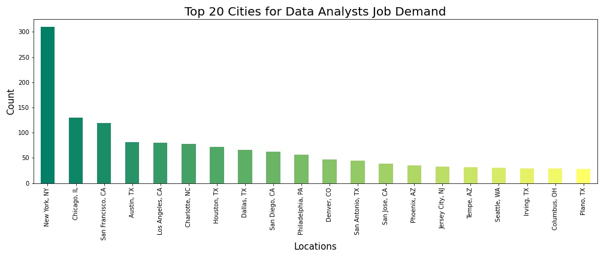

---------------------------- 

### Salary Range: 24K-190K  

Min Max Salary of Data Analyst job in Glass door in general  

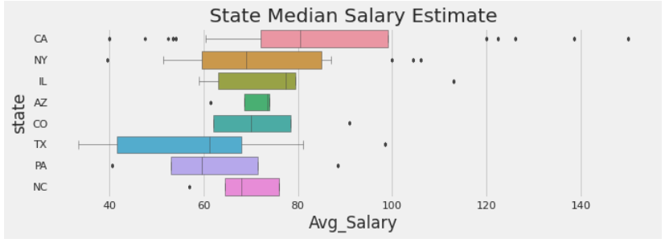

Mean of maximum salary estimate: 89 K 
Mean of minimum salary estimate:  50 K  

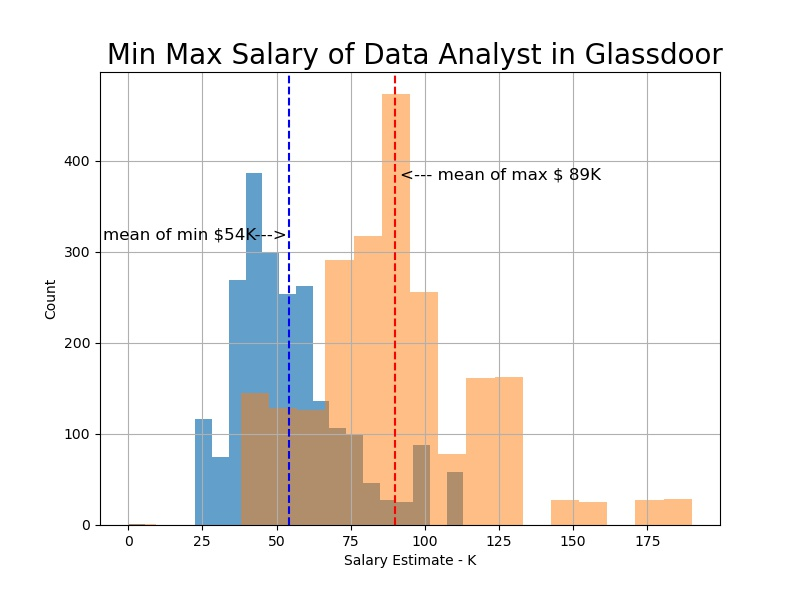

---------------------------- 

### Rich company (Company generate high revenue) looking for data analyst are : 

	- Insurance 
    Mining 
    Aerospace 
    Finance 

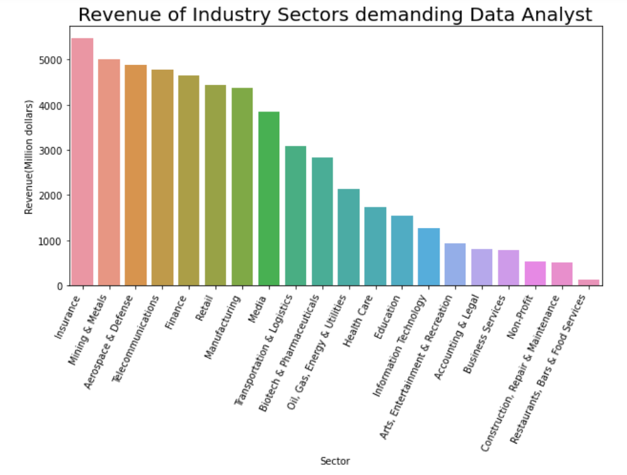

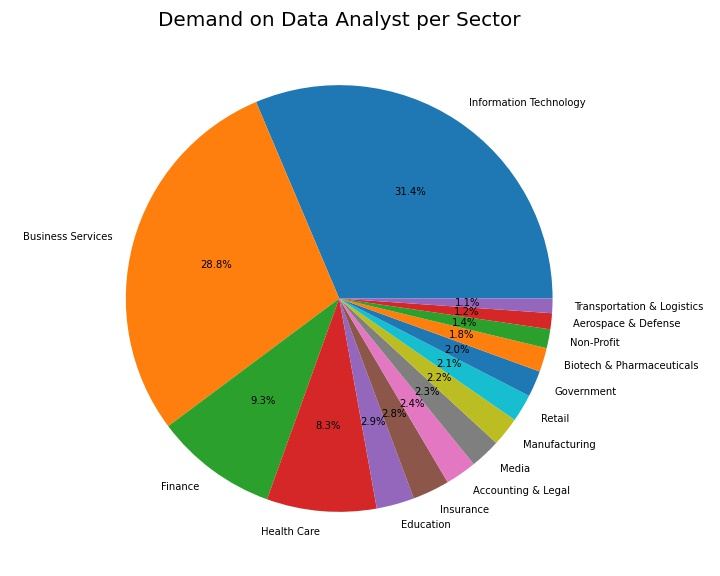

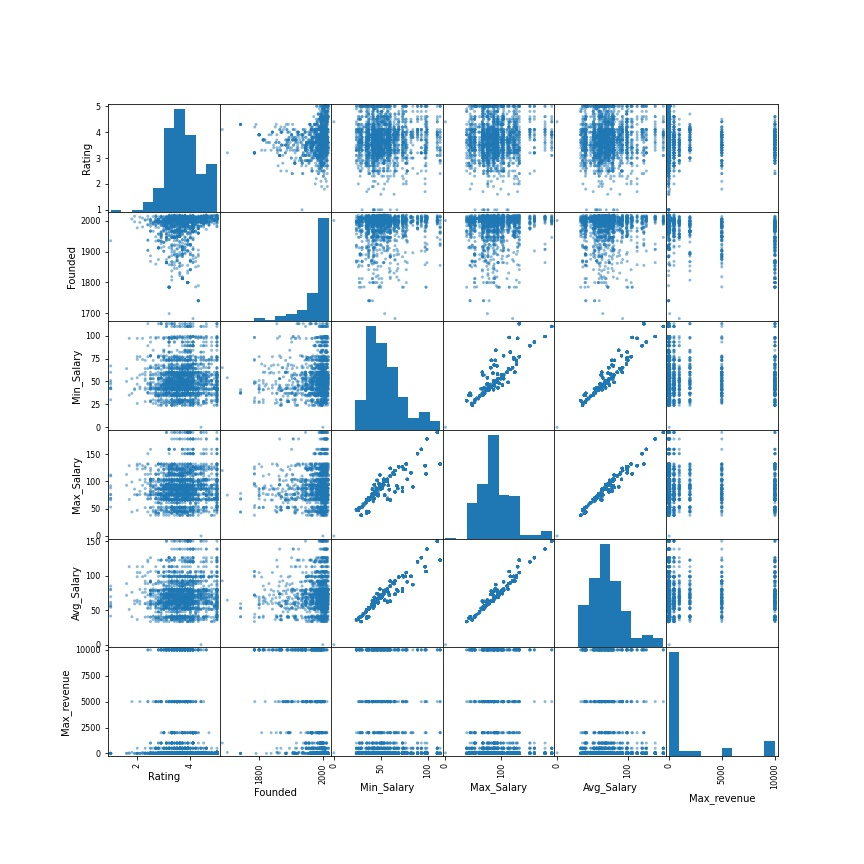

-------------Statistical Test-------------------- 

Since people who use Glassdoor rate about how good the company is, I wonder how Company rating is positively related to salary or not. Company with high rating pays more??  To answer the question, I conducted hypothesis testing.  
 
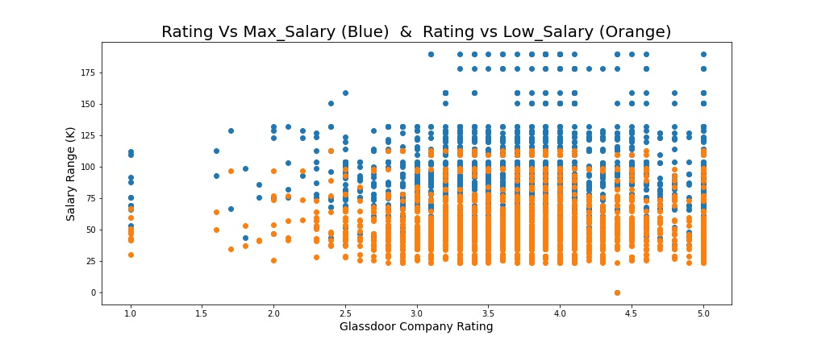

### hypothesis 1  
    
  ### Null: Company rating and high salary boundary are not positively correlated 
  ### Alternative: Company rating and high salary boundary are positively correlated 

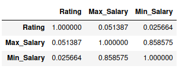

When I conducted Pearson correlation test, it shows 0.05 correlation between Rating and Max Salary and 0.02 correlation between Rating and Min Salary with my original data. Since the dataset is around 2000 samples, we are going to do bootstrapping and conduct correlation test accordingly. 
 

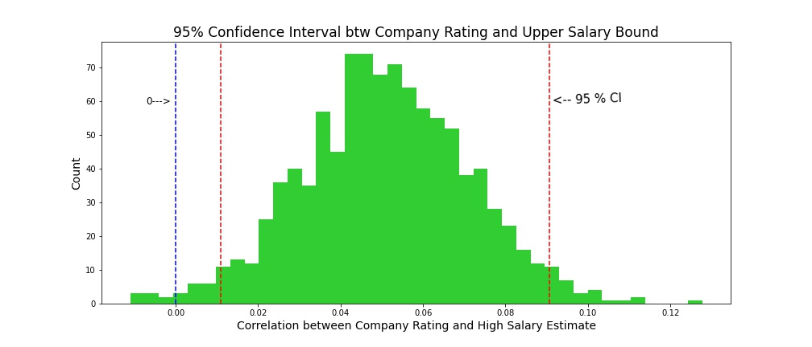

As the result, With 95% confidence interval, I can say bootstrap_salary_upper correlation is from  0.101 to 0.09  
 [0.011347007366033238, 0.09074888578231032 ] 

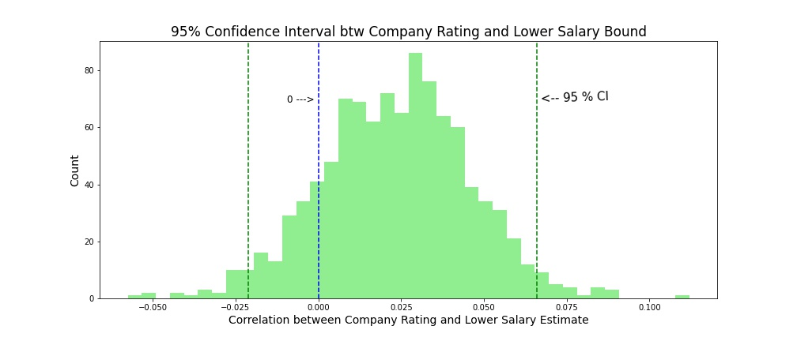

With 95% confidence interval,  bootstrap_salary_lower correlation is from from –0.02 to 0.07.  
[-0.021413976305863825, 0.07173311436767897] 

 

### Conclusion:  

* I reject Null hypothesis for company rating and higher salary because  0 is laid outside of 95% confidence interval. I can say High rating company and higher salary may be positively correlated.  

* I failed to reject Null hypothesis since my 0 is laid in 95% confidence interval  and high company rating and lower salary boundary may not be positively correlated. 

 

 

### hypothesis 2  

Since it is Glass door shows in their data that what kind of companies (which industry, how many employee they have, how much revenue they generate)  when they look for data analysts, it might be interesting to look at whether high revenue generating companies offer higher salary boundary when they offer a job to data analyst.  

 

### Null - Company revenue and high salary boundary are not positively correlated.  
### Alternative- Company revenue and high salary boundary are positively correlated. I conducted Pearson Correlation with Bootstrapping.  

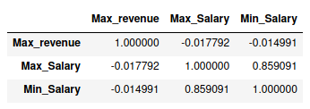

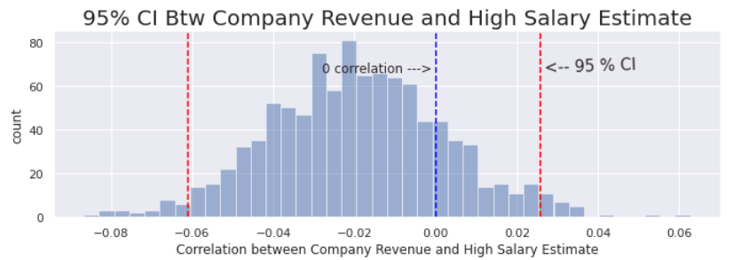

I got bootstrap_salary_upper correlation is –0.05 to 0.02 
[-0.05725261745947094, 0.022103673678014562 ] 

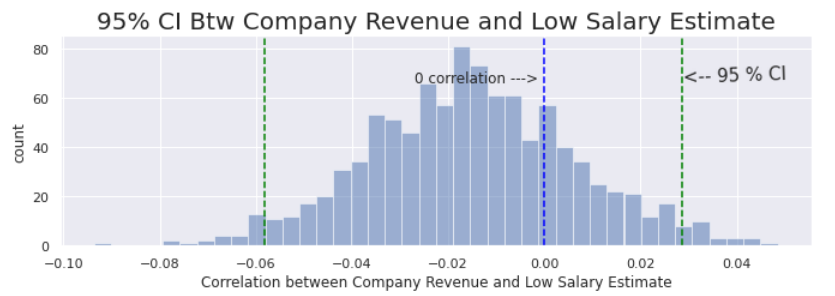

I got bootstrap_salary_lower correlation is from –0.05 to 0.02 
[-0.054171562416393065, 0.026781082702684506]  

### Conclusion:  

I failed to reject the null hypothesis for both higher and lower salary estimate with high revenue companies because 0 correlation is laid inside of 95% confidence interval.  Both correlations are less or equal in general; company makes high revenue generating and data analyst salary estimate are not positively correlated.   

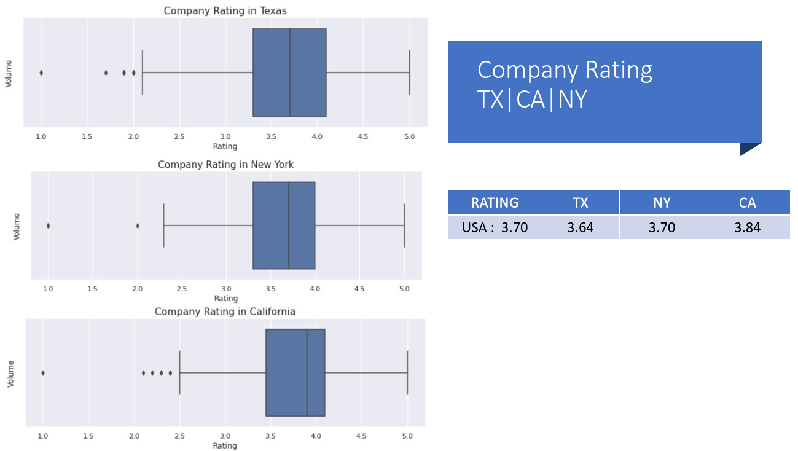

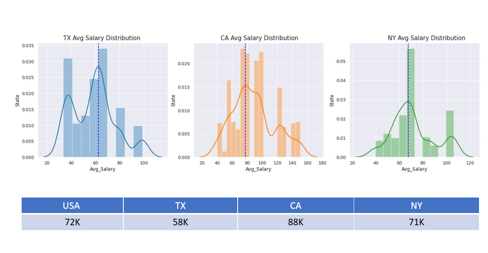

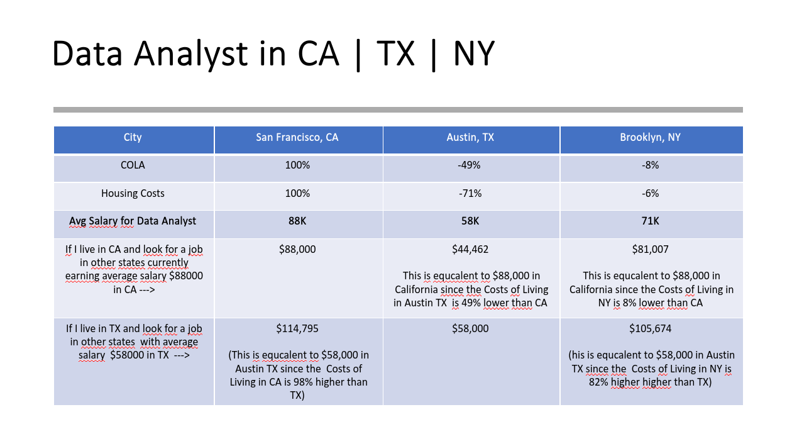

# Moving forward …. 

	I would like to investigate job description and job titles and correlation to salary estimate. Although I could find key words,  and counted how many times it mentioned but I could not spot with the column that mentions the word.       

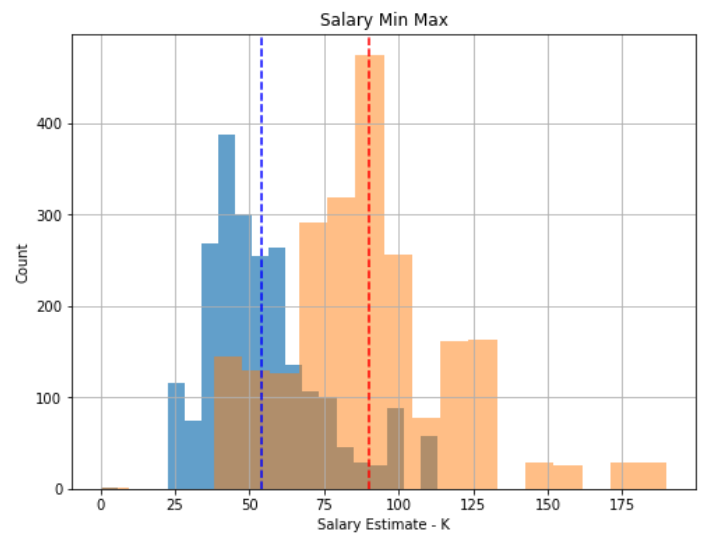

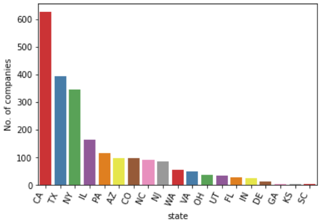

