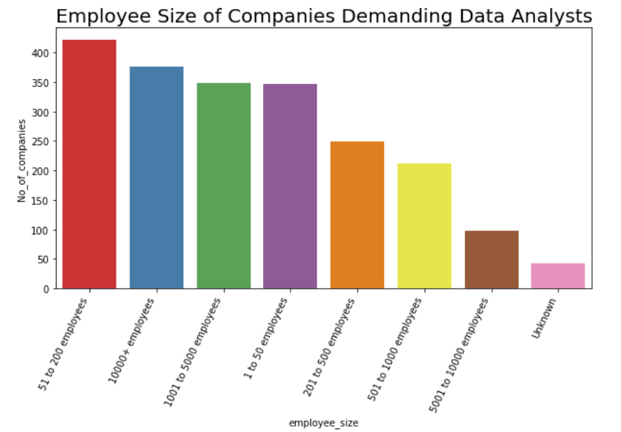
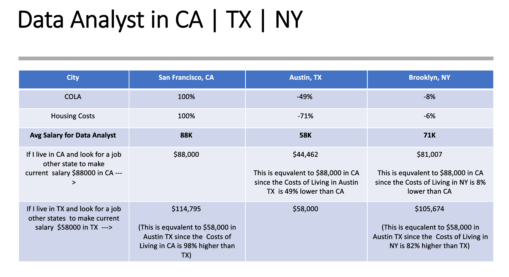

# Capstone 1 

 

Today I am going to present Glassdoor Data Analyst job posting.  

## Motivation:  

[Data Analyst Jobs](https://www.kaggle.com/andrewmvd/data-analyst-jobs) 

Amidst the pandemic many people lost their jobs, with this dataset it is possible to hone the job search so that more people in need can find employment. This dataset was created by [picklesueat](https://github.com/picklesueat/data_jobs_data) and contains more than 2000 job listing for data analyst positions, with features such as:

- 2253 job listings scraped from Glass door 
- Job title  
- Salary Range  
- Job Description  
- Rating  
- Company Name  
- Location  
- Headquarter  
- Size 
- Founded 
- Type of ownership 
- Industry 
- Sector 
- Revenue 

 

## Demand on Data Analysts per State  

 

California has most job demands followed by Texas and New York.  

 

## Top 20 cities Demand on Data Analysts  

 

Citi-wise although New York city has the most job, it is because jog postings are all over in Texas and California. 

## State Median Salary Estimate  

 

As you can see in the boxplot, California has the highest salary estimate and it is going to increase the average salary for data analyst in general.  

## Salary Range: 24K-190K  

Min Max Salary of Data Analyst job in Glass door: 

 

Mean of maximum salary estimate: 89 K  
Mean of minimum salary estimate: 50 K  

## Company generate high revenue  

Company generates high revenue looking for data analyst are: 

- Insurance  
- Mining and Metals  
- Aerospace and Defense  
- Telecommunications 
- Finance  

 

Insurance industries generate most revenue and next is mining. Interestingly Information & Technology is 14th on Revenue generating wise. 

## Industrial Sector Demanding Data Analyst 

 

Of course, Information & Technology companies look for lots of Data Analyst as we expected.  

## Employee Size Demanding Data Analyst 

 

Could not find the meaningful relationship between job demand for data analyst and company size (employee size). 

## Relationship between Information  

There are numerically measurable data on salary estimate, company rating, company location, industrial sector, and revenue of the company that look for data analysts.  

 

## Stastical Test  

Since people who use Glassdoor rate about how good the company is (unique feature comparing to other job posting site), I wonder how company rating is positively related to salary the company can offer. Company with high rating pays more?? To answer the question, I conducted hypothesis testing.  

This is scatter plot between company rating and salary estimate. Blue is high / max salary boundary and orange is low/min salary boundary.  

 

## hypothesis 1  

- **H0: Company rating and high salary boundary are not positively correlated.**  
- **H1: Company rating and high salary boundary are positively correlated.**  

When I conducted Pearson correlation test, it shows 0.05 correlation between Rating and Max Salary and 0.02 correlation between Rating and Min Salary with my original data. 

 

Since the dataset is approx. 2000 samples, I am going to do bootstrapping and to conduct correlation test accordingly.  

 

As the result, With 95% confidence interval, I can say bootstrap_salary_upper correlation is from 0.101 to 0.09  

[0.011347007366033238, 0.09074888578231032 ]  

 

With 95% confidence interval, bootstrap_salary_lower correlation is from from –0.02 to 0.07.  

[-0.021413976305863825, 0.07173311436767897]  

### Conclusion:  

* I reject Null hypothesis for company rating and higher salary because 0 is laid outside of 95% confidence interval. I can say High rating company and higher salary may be positively correlated.  

* I failed to reject Null hypothesis since my 0 is laid in 95% confidence interval and high company rating and lower salary boundary may not be positively correlated.  

## hypothesis 2  

Since Glassdoor shows in their data about what kind of companies (which industry, how many employees they have, how much revenue they generate), when they look for data analysts, it might be interesting to look at whether high revenue generating companies offer higher salary boundary when they offer a job to data analyst.  

- **H0: Company revenue and high salary boundary are not positively correlated.**  
- **H1: Company revenue and high salary boundary are positively correlated.**  

When I conducted Pearson correlation test, it already shows negative correlation between Rating and Max Salary (-0.017) and -0.014 correlation between Rating and Min Salary with my original data. 

 

I conducted Pearson Correlation with Bootstrapping 1000 times.  

 

I got bootstrap_salary_upper correlation is –0.05 to 0.02  
[-0.05725261745947094, 0.022103673678014562 ]  

 

I got bootstrap_salary_lower correlation is from –0.05 to 0.02  

[-0.054171562416393065, 0.026781082702684506]  

### Conclusion:  

I failed to reject the null hypothesis for both higher and lower salary estimate with high revenue companies because 0 correlation is laid inside of 95% confidence interval. Both correlations are less or equal in general; company makes high revenue generating and data analyst salary estimate are not positively correlated.  

## Texas vs California vs New York  

Since CA, NY, TX are the highest Data Analysts demanding states in Glassdoor, I spent some time to investigate company rating and average salary estimate for those states.  

Glassdoor average review for the company is 3.7. Interestingly Texas is lower than statewide average and California is higher than average.  

 

In case of salary estimate, California pays most and Texas pays the least.  

 

Due to the difference on salary gap, I made a table of the cost of livings adjustment comparison reflecting average salary per state. 

 

## Moving forward ….  

I would like to investigate job description and job titles and correlation to salary estimate. Although I could find key words and rank about how many times the keywords are mentioned but I could not spot the information column that mentions the word. With Natural Language Process, there will be wider spectrum to explore about this data and to find more meaningful relationship.  

